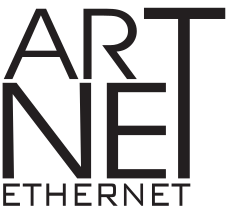

  [](https://badge.fury.io/py/aioartnet)

**aioartnet** is a pure python [asyncio connector](https://docs.python.org/3/library/asyncio.html) for the [royalty-free Art-Net protocol](https://art-net.org.uk/background/), which is a transport to transmit and recieve the [DMX-512 lighting control protocol](https://en.wikipedia.org/wiki/DMX512) over Ethernet (UDP). The protocol is the modern standard for interconnecting complex lighting fixtures directly, and for branching out individual universes for a specific local area to control classic DMX-512 XLR-cable interlinked fixtures. Both open and propriety lighting control systems can emit Art-Net directly.

This library aims to be simple and robust, and can both input data into Art-Net, as well as output it from "artnet" to your user code. It builds a dynamic model of the network's Art-Net nodes, their ports and the universe(s) of DMX-512 that are being controlled. Fully type hinted to comply with `PEP-561`. No non-core dependancies, with a test suite that runs on Python 3.9 to 3.12.

It can also be used __passively__ to build the network model without joining as an Art-Net Node, by listening to the broadcasts from other Art-Net devices. However it is not usually possible to monitor the DMX values passively.

We also have a propriety iOS/Xcode component available for commercial licensing that uses the same event driven API as this code, built on top of Apple's Networking framework `NWProtocolUDP`. This will be a significantly better starting point for new designs than [libartnet](https://github.com/OpenLightingProject/libartnet) for most projects.

Install & Demo
====

Use `pip` to install [the package from pypi](https://pypi.org/project/aioartnet/). Running `aioartnet.main` will show other nodes and universes discovered:

    $ pip install aioartnet
    $ python -m aioartnet.main
    INFO:aioartnet:preferred interfaces: [(1, 'wlp4s0'), (10, 'br-ee82b9af434e'), (10, 'docker0'), (10, 'lo')]
    INFO:aioartnet:using interface wlp4s0 with ip 192.168.1.205 broadcast ip 192.168.1.255
    INFO:aioartnet:configured own port Port<Input,DMX,0:0:1>
    INFO:aioartnet:configured own port Port<Output,DMX,0:0:5>
    status:
      ArtNetNode<aioartnet,192.168.1.205:6454>                     [Port<Input,DMX,0:0:1>, Port<Output,DMX,0:0:5>]
      ArtNetNode<ODE Mk3,192.168.1.238:6454>                       [Port<Output,DMX,0:0:0>, Port<Output,DMX,0:0:1>]
      ArtNetNode<DMX Monitor,192.168.1.222:6454>                   []
     0:0:1 pubs:[ArtNetNode<aioartnet,192.168.1.205:6454>] subs:[ArtNetNode<ODE Mk3,192.168.1.238:6454>]
     0:0:5 pubs:[] subs:[ArtNetNode<aioartnet,192.168.1.205:6454>]
     0:0:0 pubs:[] subs:[ArtNetNode<ODE Mk3,192.168.1.238:6454>]

There is a built in command-line lighting console for quick Art-Net testing, which maps channels 1:1 to a single universe:

    $ python -m aioartnet.console --universe 0:0:0
    INFO:aioartnet:configured own port Port<Input,DMX,0:0:0>
    INFO:aioartnet:preferred interfaces: [(1, 'wlp4s0'), (10, 'br-ee82b9af434e'), (10, 'docker0'), (10, 'lo'), (10, 'lxdbr0')]
    INFO:aioartnet:using interface wlp4s0 with ip 192.168.1.204 broadcast ip 192.168.1.255, listening on 0.0.0.0 our mac 4485009be628
    > live on
    > ch 1 at f
    > record cue 1
    > ch 2 at f
    > record cue 2
    > go
    activated ActiveCue(cue=Cue(name='', fade_in=0, hold=1, fade_out=0, channels=[ChannelIntensity(channel=0, intensity=255)]), since=1750845334.3249245, state=<FadeState.FADE_IN: 2>)
    finished ActiveCue(cue=Cue(name='', fade_in=0, hold=1, fade_out=0, channels=[ChannelIntensity(channel=0, intensity=255)]), since=1750845334.3249245, state=<FadeState.OFF: 1>)
    > go
    activated ActiveCue(cue=Cue(name='', fade_in=0, hold=1, fade_out=0, channels=[ChannelIntensity(channel=1, intensity=255)]), since=1750845336.5779428, state=<FadeState.FADE_IN: 2>)
    finished ActiveCue(cue=Cue(name='', fade_in=0, hold=1, fade_out=0, channels=[ChannelIntensity(channel=1, intensity=255)]), since=1750845336.5779428, state=<FadeState.OFF: 1>)
    > [ctl-C]


Getting Started - Code
====

1) Import the library and create an `ArtNetClient`
```python
    from aioartnet import ArtNetClient
    client = ArtNetClient()
```
2) Configure the desired input/output ports on the client using `set_port_config()`, each call returns `ArtNetUniverse` objects. Use these to optionally set the initial published value of universes set as ArtNet inputs:
```python
    u1 = client.set_port_config("0:0:1", is_input=True)
    u5 = client.set_port_config("0:0:5", is_output=True)
    u1.set_dmx(bytes(list(range(128))*4))
```

3) Await the co-routine `client.connect()` from an asyncio asynchronous context, e.g:
```python
    async def main() -> None:
        client = ArtNetClient()
        u1 = client.set_port_config("0:0:1", is_input=True)
        u5 = client.set_port_config("0:0:5", is_output=True)
        u1.set_dmx(bytes(list(range(128))*4))
        await client.connect()

    if __name__ == "__main__":
        logging.basicConfig(level=logging.INFO)
        asyncio.run(main())
        asyncio.get_event_loop().run_forever()
```

4) Once the client is connected, you can add/configure further ports, read the universes of DMX data with `universe.get_dmx()` and for input ports, change the published values with `universe.set_dmx(bytes)`.

5) The return value from `client.connect()` is an `ayncio.DatagramTransport`. If you call `close()` on this transport, the periodic task is also cancelled.


Networking
----

There are three ways to configure the networking:

### Automatically

Creating an `ArtNetClient` with no arguments will perform discovery during `connect()` by iterating the interfaces available, checking if they have an IPV4 address (ie. `AF_INET` family) and prefering certain properties. Specifically we prefer `2.x.x.x` subnets with the `255.0.0.0` subnet mask, then configured Ethernet (interface name `enp*`), then configured WiFi interfaces (`wlp*`), followed by any other remaining `AF_INET` interfaces. The priority ordering is set by `aioartnet.PREFERED_INTERFACES_ORDER` which can be monkey-patched if required.

### Manually by specifying an interface

Passing an interface name to the constructor `ArtNetClient(interface="en0")`, or setting `client.interface="en0"` before calling `connect()` will force use of a specific interface, skipping the interface selection logic. The interface is then queried to determine the ip, broadcast and listening address to use using `ioctl` calls.

### Manually by specifying unicast and broadcast IPs

If the two required IP addresses (ours, broadcast) are set manually on the client no discovery is performed. This will be the most portable method as we effectively supply the arguments directly to asyncio.

```python
client = ArtNetClient()
client.unicast_ip = '192.168.1.15'
client.broadcast_ip = '192.168.1.255'
await client.connect()
```


Features
====

| Message                                | Recieve             | Transmit           |
|----------------------------------------|---------------------|--------------------|
| Node and universe discovery            | :heavy_check_mark:  | :heavy_check_mark: |
| 15-bit port addresses                  | :heavy_check_mark:  | :heavy_check_mark: |
| >4 ports (bindIndex) on same IP        | :heavy_check_mark:  | :heavy_check_mark: |
| merge-mode (LTP/HTP) in reciever       | -                   | -                  |
| RDM commands to enumerate fixtures     | -                   | -                  |
| Timecode                               | -                   | -                  |
| Multi-universe sync message            | -                   | -                  |
| local node reconfigure by API          | :heavy_check_mark:  | :heavy_check_mark: |
| remote reconfigure (by ArtAddress etc) | -                   | -                  |
| Fixture firmware upgrade messages      | Not planned         | Not planned        |

Implemented Messages
-----

| Message                            | Recieve             | Transmit           |
|------------------------------------|---------------------|--------------------|
| ArtPoll                            | :heavy_check_mark:  | :heavy_check_mark: |
| ArtPollReply                       | :heavy_check_mark:  | :heavy_check_mark: |
| ArtDMX                             | :heavy_check_mark:  | :heavy_check_mark: |
| ArtIpProg / ArtIpProgReply         | -                   | -                  |
| ArtAddress                         | -                   | -                  |
| ArtDataRequest / ArtDataReply      | -                   | -                  |
| ArtDiagData                        | -                   | -                  |
| ArtTimeCode                        | -                   | -                  |
| ArtCommand                         | -                   | -                  |
| ArtTrigger                         | -                   | -                  |
| ArtSync                            | -                   | -                  |
| RDM ArtTodRequest / ArtTodData / ArtTodControl / ArtRdm / ArtRdmSub | - | - |


Art-Net
----

This application aims to be fully compatible with Art-Net devices. We have tested it with:

* [QLC+ lighting controller](https://www.qlcplus.org/)
* [Enttec ODE Mk3](https://www.enttec.com/product/dmx-distribution/ode-mk3-dmx-ethernet-converter/)
* iOS [DMX Monitor app](https://apps.apple.com/us/app/dmx-monitor/id1544911427)
* Many other iOS apps


 Art-Net™ Designed by and Copyright Artistic Licence Engineering Ltd.
